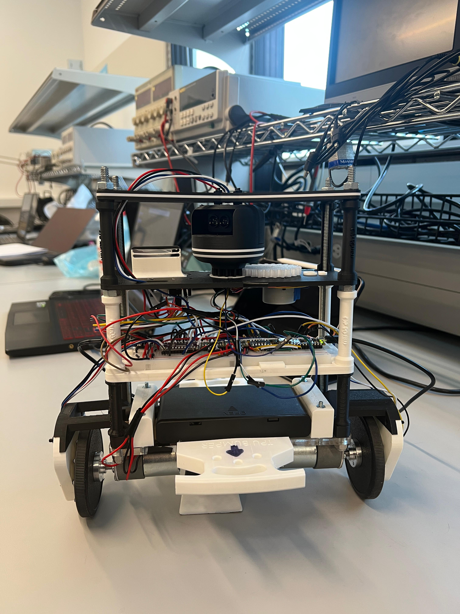

# Welcome to My Portfolio

This repository highlights a collection of hardware and robotics projects I have contributed to during my time at the **University of British Columbia** and through design teams. Projects span PCB design, embedded systems, robotics control, and mechanical integration.

---

## 🚤 UBC Sailbot – Communications Systems Lead (ELEC)  
*Jan 2022 – Present*  

As Communications Systems Lead, I manage a 9-member subteam developing hardware for an autonomous sailing robot. I designed and tested multiple custom PCB Hats for stacked Nucleo U5 boards using Altium Designer, built 2 and 4 layer PCBs for various ECUs that are distributed across the sailing robot. The core of these ECUs is Nucleo U575ZI-Q. All these ECUs are connected to various sensors, and each of these units communicates with CANFD. Hence, various PCBs, with power regulation and communication protocol support, had to be implemented. This included buck converters and high-side switching to make the most of the single 12V power line. Furthermore, to support various sensors, circuitry for UART, I2C, RS232, and CAN-FD protocols with transceivers, level shifters, and controllers had to be implimented. My role also included developing CAD enclosures in SolidWorks, soldering and testing completed enclosures with the physical hardware like sensors, actuators, and facilitating workshops and design reviews to enhance collaboration.

More information on these PCBs and other work can be found in the UBC Sailbot Folder. Detailed descriptions are given in their respective Readme Files

### 📷 Images  
  
  
 

---

## 🤖 Two-Wheeled Self-Balancing Mapping Robot  
*Jan 2025 – Apr 2025*  

This project involved collaborating in a 3-person team to build a self-balancing robot using PID control on an Arduino Nano. I designed and fabricated mechanical mounts for the LiDAR, stepper motors, slip ring, and encoders in SolidWorks, programmed the BMI270 IMU and magnetic encoders, and contributed to firmware development and MATLAB-based control system modeling

### 📷 Images  
  

## 🪙 RC Coin-Picking Robot  
*Feb 2024 – Apr 2024*  

As team lead, I guided a 6-member group to design and build a remote-controlled robot capable of detecting and retrieving coins. The system featured an H-Bridge circuit with optocouplers to protect the microcontroller and a custom coin detection mechanism using a Colpitts oscillator, magnet, MOSFETs, voltage dividers, and additional optocouplers for signal conditioning:contentReference[oaicite:2]{index=2}.  

### 📷 Images  
  

---

## 🖥️ Server Robot  
*Oct 2023 – Nov 2023*  

Built during UBC’s Designathon, this personal project was a prototype line-tracking robot designed to serve food. The robot used Arduino with IR and sonar sensors for navigation, obstacle avoidance, and IR-based line tracking. I also implemented a Python script with a breadth-first search algorithm for pathfinding to optimize delivery routes to tables:contentReference[oaicite:3]{index=3}.  

### 📷 Images  
  
 

---

## 🔧 Skills Summary  
Through these projects, I gained hands-on experience in **PCB design, embedded systems, and communication protocols**, as well as practical expertise in **power electronics, CAD design, and control systems**. Each project required full-cycle development—from schematic design and prototyping to soldering, testing, and integration into enclosures—giving me end-to-end hardware engineering and robotics experience.  

---
