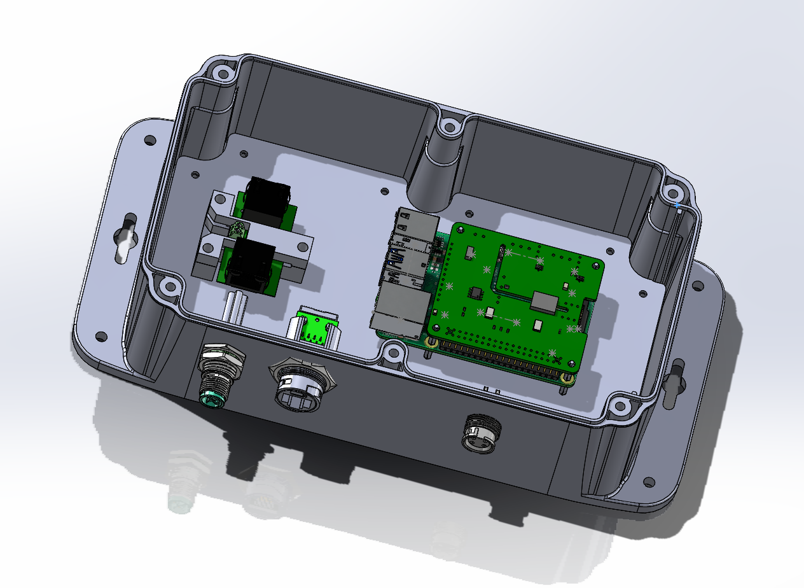

# UBC Sailbot – Electrical Documentation

This folder contains documentation and resources related to some of the projects I have worked on POLARIS boat at Sailbot.  
It is divided into three main areas: the **Mainframe GUI**, **PCBs**, and **Enclosures**.

---

## 📌 1. PCBs (`pcbs.md`)

This folder contains two of the Breakout Boards/ Shields that I worked on, which include the Rudder V2 and Sail V3. 
Sail V3 is my latest design; however, this will be ordered and tested in October.

## 📌 2. Mainframe GUI 

For our first water and land test, our team needed a quick solution to be able to control the actuators and read sensor data using ssh with
the Raspberry Pi onboard, which connects to other electronic control units on the boat through CANFD

## 📌 3. Enclosures

This folder documents the design and integration of **enclosures** for three ECUs, which were for the SENSE, PDB and MAINFRAME 
These enclosure CADs were made to assess if the connectors selected fit, and also for waterjet cutting the enclosures

#Mainframe Enclosure

#SENSE Enclosure

#PDB Enclosure

